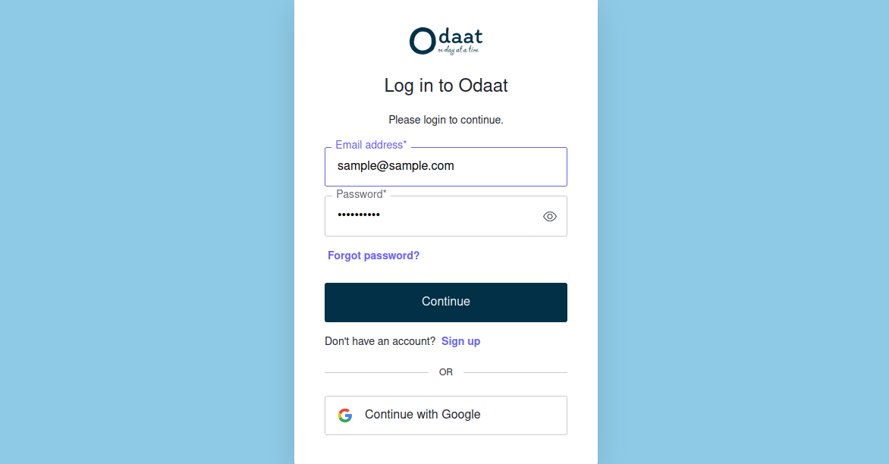
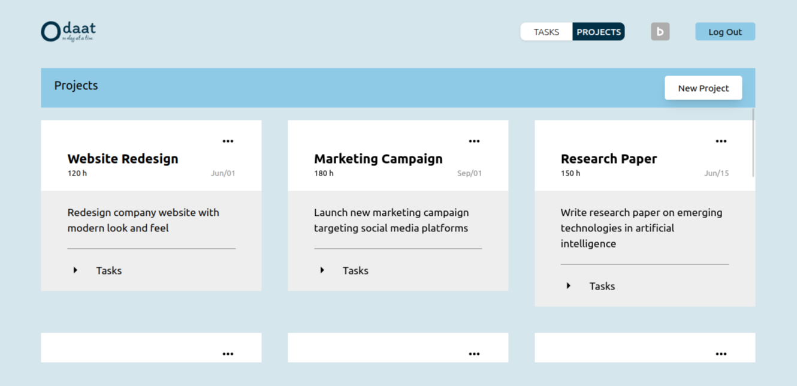
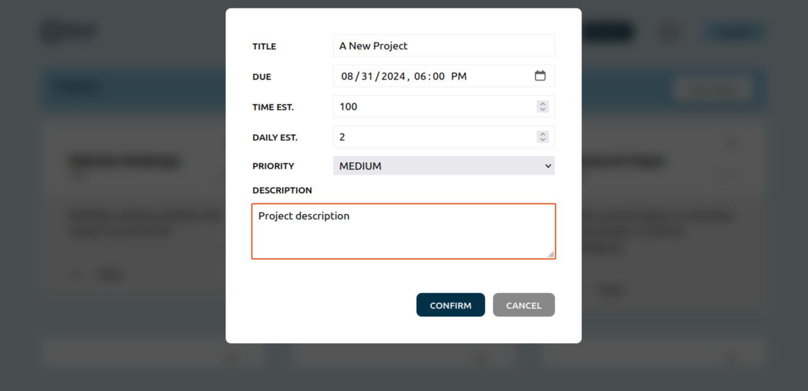
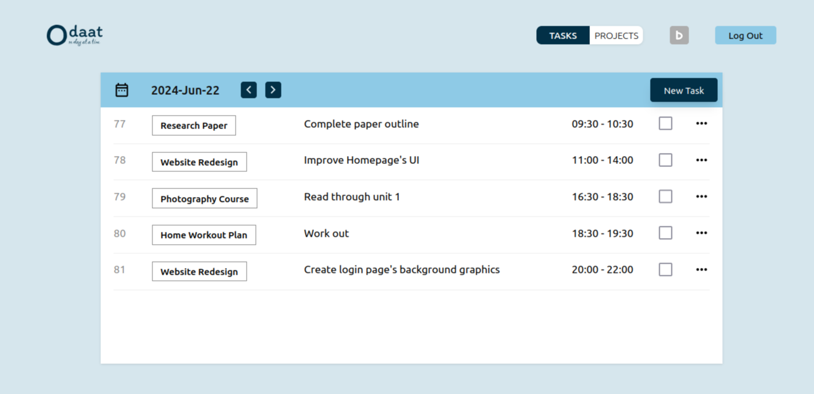
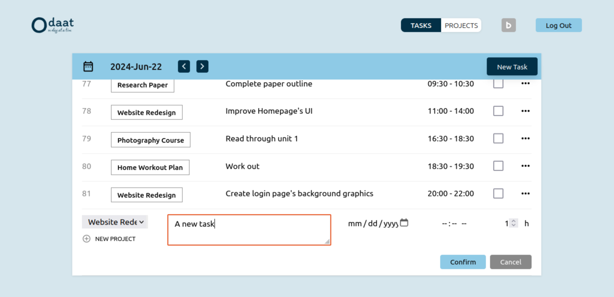

---
# Odaat Version 1.0.0 | 2024 June 24
---

## Table of Contents
- About
- Application
- Functionalities
- Technologies
- Setup
- Further Development

## About
- This project is built to show my development skills at the moment.
- It is a full stack project, with TypeScript (React) for the frontend and Java (Spring) for the backend.
- As I have a full time job and other responsibilities besides this, I chose the most familiar tech stack so that I could move fast and do more things.
- It took around 80 hours of work, which I spent from 2024 June 7 to 2024 June 24.
- Although there is still room for improvement, the application is functional, testable, and maintainable.
- If I had more time, I would work on the issues mentioned in the **Further Development** section.

## Application
- A personal management application that can be used to organize your work into **projects**, **tasks**, and **daily todos**.
- "Projects" are long term work, or repetitive activities. They can include both professional and personal work. Some examples would be *"Create a Marketing Campaign"*, *"Build MyApp"*, or *"Excersise Daily"*.
- "Tasks" are small chunks of work that can be done in one sitting towards the completion of a certain project. Some examples would be *"Design the Key Visual"*, *"Write Unit Tests"*, or *"Go for a Walk"*.
- With the philosophy of consistently making incremental improvements, the application is named **"Odaat"**, or *"One Day at a Time"*.

## Functionalities
- User can login / signup / logout via with an email+password, or with a google account.

- User can create/update/delete projects.

- User can create/update/delete tasks.

- User can synchronize projects and issues they have on Backlog with Odaat, via oauth2, to automatically generate projects and tasks.

## Technologies
- Backend:  **Java** (Spring Boot, Spring Security, Spring Data)
- Frontend: **TypeScript** (React)
- UI:       TailwindCSS
- Testing:  JUnit, Jest, Playwright
- Database: MySQL
- Others:   Docker, Flyway, auth0

## Setup
### Requirements
- JDK
- Node
- MySQL

### Steps
- Create an `application.properties` file under `/spring-server/odaat/src/main/resources`.
- Populate the file with sample properties from `/spring-server/odaat/src/main/resources/application.properties.example`.
- Fill in necessary values.
- Run `./run-dev.sh` (if 'permission denied', give permissions with `chmod +x ./run-dev.sh`).
- Web application can be accessed on `localhost:5173`.

### Testing
- Unit and integration tests can be executed with `./run-test.sh`.

## Further Development
### Frontend
- Improve responsiveness.
- Handle different `Date` formats.
- Add more unit tests.

### Backend
- Validate create/update requests.
- Version APIs.
- Add more unit tests.

### Features
- Sync local data to Backlog (e.g. completing a Task can update the related issue on Backlog).
- Generate tasks automatically when a Project is created.
- Visualize progress.