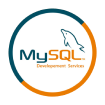
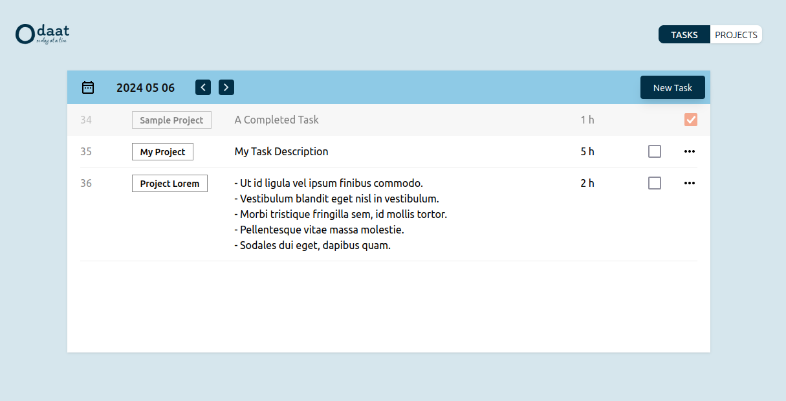
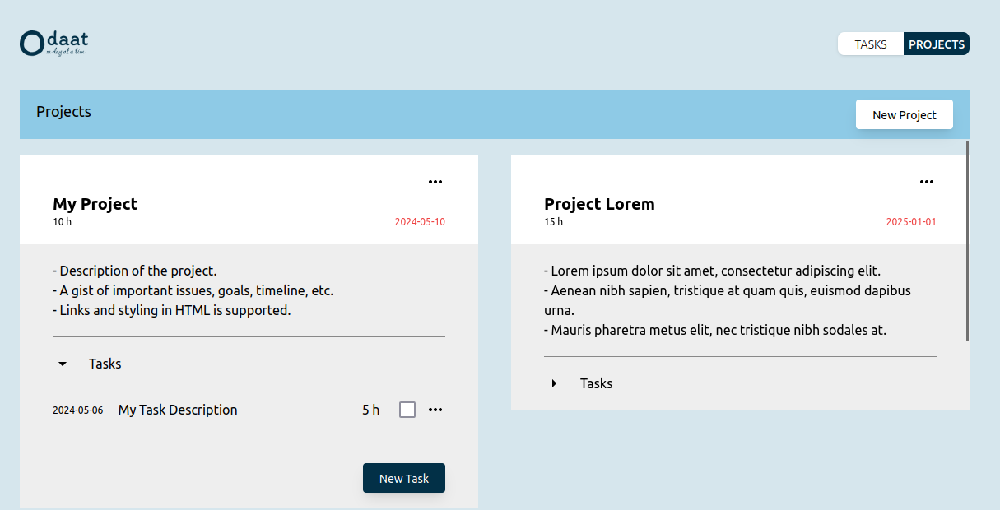
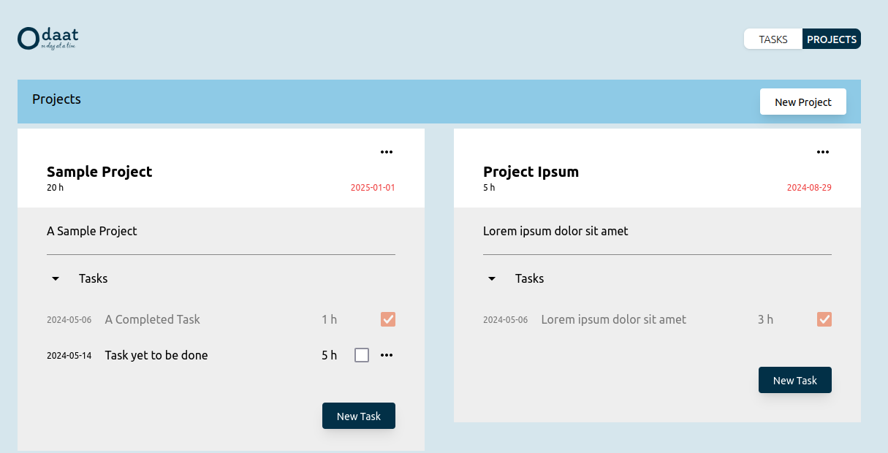

# ODAAT - Personal Task Management Tool

    
    Scala
    
    Play
    
    JavaScript
    
    TypeScript
    
    React
    
    MySQL
    
    Docker

## Tech Stack
- Scala (Play framework)
- JavaScript/TypeScript (React)
- MySQL

## Features

### Tasks

- Keep track of all tasks.
- Oragnize tasks based on date and project.
- View detailed tasks for each day.

### Projects

- Turn your long-term goals into doable chunks.
- Create, update, and prioritize work.
- Manage tasks based on different projects.

### Progress

- Update your progress with a single click.
- Track completion dates and deadlines for each project.
- Adjust daily tasks by moving them between dates.

## Setup
You can run the application by:
1. Downloading this repository
2. Executing either of the following options

#### Option 1: Using Docker
1. Install [docker](https://docs.docker.com/engine/install/) and [docker compose](https://docs.docker.com/compose/install/) on your machine.
2. Run `docker compose up -d`
3. Go to `http://localhost:9090/`

#### Option 2: Using Bash
1. Make [MySQL](https://www.mysql.com/) available on your machine.
2. Setup database and user credentials in accordance with [application configurations](https://github.com/swunoo/odaat/blob/main/server/odaat-server/conf/application.conf).
3. Make the script executable by running `chmod +x run.sh`
4. Run the script with `./run.sh`
3. Go to `http://localhost:5173/`

## Further Development
The following features are to be added soon.
- Cloud deployment with authentication
- Daily/monthly report generation
- Calendar view
