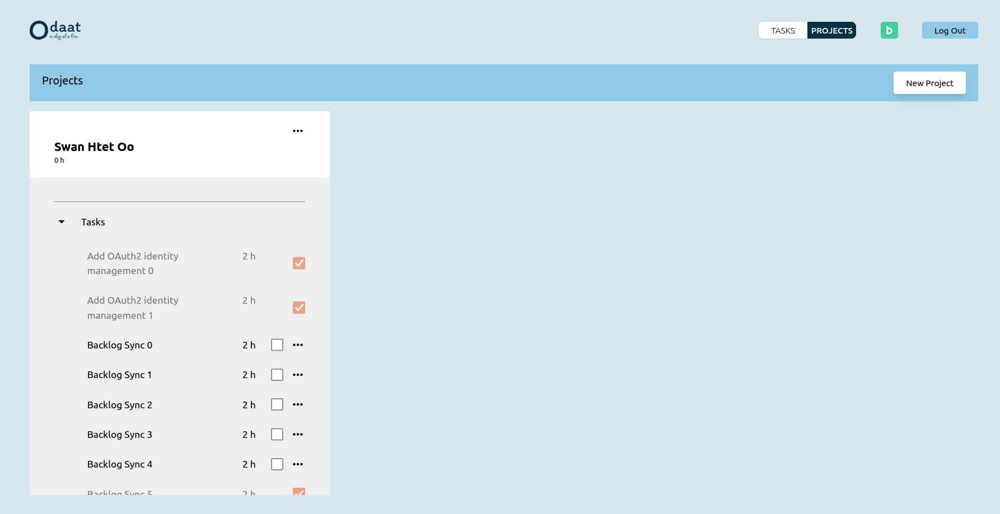

---
# Odaat Version 1.0.0 | 2024 June 23
---

**[日本語]**

## 目次
- 概要
- 機能
- 技術
- デザイン
- セットアップ
- 追加開発

## 概要
- 個人向けの管理アプリケーションで、**プロジェクト**、**タスク**、**日常のToDo** を整理できます。
- **プロジェクト** は長期間の仕事や繰り返し行う活動です。プロフェッショナルや個人の業務を含みます。例えば、*"マーケティングキャンペーンの作成"*, *"アプリの開発"*, *"毎日の運動"* などがあります。
- **タスク** はプロジェクトの完了に向けて一回の作業で行える小さな作業です。例えば、*"キービジュアルのデザイン"*, *"ユニットテストの作成"*, *"散歩に行く"* などがあります。
- 持続的な改善の哲学から、このアプリケーションは **"Odaat"**、つまり **"一日一日"** と名付けられました。

## 機能
- ユーザーはメールとパスワード、またはGoogleアカウントでログイン／サインアップ／ログアウトできます。

- ユーザーはプロジェクトを作成／更新／削除できます。

- ユーザーはタスクを作成／更新／削除できます。

- ユーザーはOAuth2を使用してBacklogのプロジェクトや課題をOdaatに同期させることができます。

## 技術
- バックエンド: **Java** (Spring Boot, Spring Security, Spring Data)
- フロントエンド: **TypeScript** (React)
- UI: TailwindCSS
- テスト: JUnit, Jest, Playwright
- データベース: MySQL
- その他: Docker, Flyway, auth0

## セットアップ
### 必要条件
- JDK
- Node
- MySQL

### 手順
- `/spring-server/odaat/src/main/resources` に `application.properties` ファイルを作成します。
- `/spring-server/odaat/src/main/resources/application.properties.example` のサンプルプロパティを追加します。
- 必要な値を埋めます。
- `./run-dev.sh` を実行します（もし 'permission denied' の場合は `chmod +x ./run-dev.sh` で権限を与えます）。
- Webアプリケーションは `localhost:5173` でアクセスできます。

### テスト
- 単体テストや統合テストは `./run-test.sh` で実行できます（もし 'permission denied' の場合は `chmod +x ./run-dev.sh` で権限を与えます）。

## 追加開発
### フロントエンド
- UIレスポンシブの改善。
- 異なる `Date` フォーマットの対応。
- さらにテ単体テストの追加。

### バックエンド
- 作成／更新リクエストのバリデーション。
- APIのバージョニング。
- さらにテ単体テストの追加。

### 機能
- ローカルデータをBacklogに同期する（例: タスクの完了が関連するBacklogの課題を更新する）。
- プロジェクトの作成時に自動的にタスクを生成する。
- 進捗状況の可視化。

## その他の文書
- 初期の概要 [[Brief (V1.0)]]
- 初期の設計 [[設計書]]

---

**[ENG]**

## Table of Contents
- About
- Functionalities
- Technologies
- Setup
- Further Development

## About
- A personal management application that can be used to organize your work into **projects**, **tasks**, and **daily todos**.
- "Projects" are long term work, or repetitive activities. They can include both professional and personal work. Some examples would be *"Create a Marketing Campaign"*, *"Build MyApp"*, or *"Excersise Daily"*.
- "Tasks" are small chunks of work that can be done in one sitting towards the completion of a certain project. Some examples would be *"Design the Key Visual"*, *"Write Unit Tests"*, or *"Go for a Walk"*.
- With the philosophy of consistently making incremental improvements, the application is named **"Odaat"**, or *"One Day at a Time"*.

## Functionalities
- User can login / signup / logout via with an email+password, or with a google account.

- User can create/update/delete projects.

- User can create/update/delete tasks.

- User can synchronize projects and issues they have on Backlog with Odaat, via oauth2, to automatically generate projects and tasks.

## Technologies
- Backend:  **Java** (Spring Boot, Spring Security, Spring Data)
- Frontend: **TypeScript** (React)
- UI:       TailwindCSS
- Testing:  JUnit, Jest, Playwright
- Database: MySQL
- Others:   Docker, Flyway, auth0

## Setup
### Requirements
- JDK
- Node
- MySQL

### Steps
- Create an `application.properties` file under `/spring-server/odaat/src/main/resources`.
- Populate the file with sample properties from `/spring-server/odaat/src/main/resources/application.properties.example`.
- Fill in necessary values.
- Run `./run-dev.sh` (if 'permission denied', give permissions with `chmod +x ./run-dev.sh`).
- Web application can be accessed on `localhost:5173`.

### Testing
- Unit and integration tests can be executed with `./run-test.sh` (if 'permission denied', give permissions with `chmod +x ./run-dev.sh`).

## Further Development
### Frontend
- Improve responsiveness.
- Handle different `Date` formats.
- Add more unit tests.

### Backend
- Validate create/update requests.
- Version APIs.
- Add more unit tests.

### Features
- Sync local data to Backlog (e.g. completing a Task can update the related issue on Backlog).
- Generate tasks automatically when a Project is created.
- Visualize progress.

## Other Documents
- Initial Brief [[Brief (V1.0)]]
- Initial Design [[設計書]]